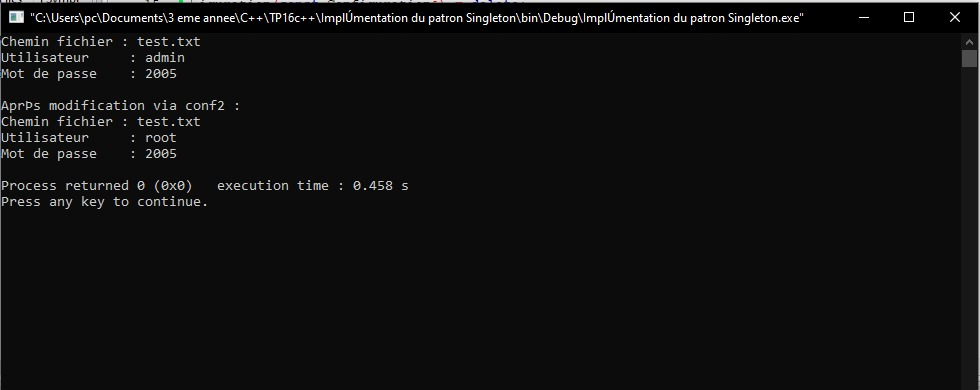
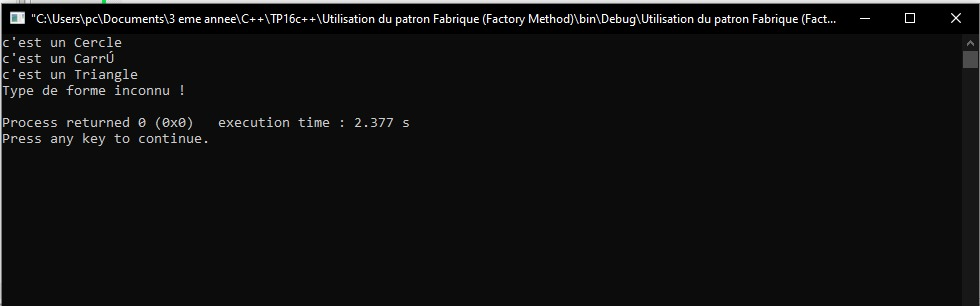
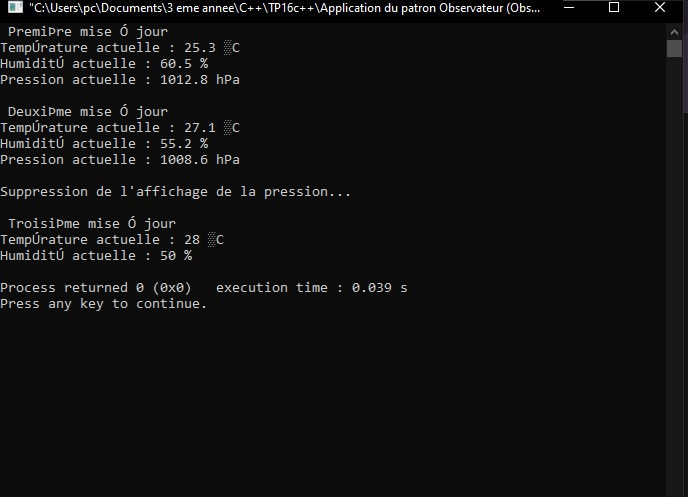
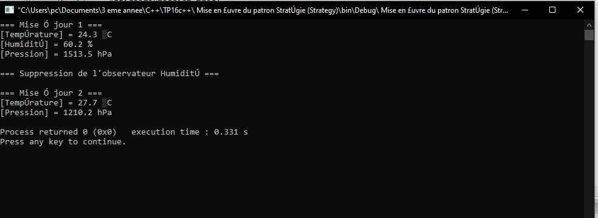

# TP16 : Patrons de conception  
**Cours : Programmation orientée objet – C++**

---

## 🎯 Objectifs pédagogiques
Ce TP a pour but de comprendre et d’implémenter quatre patrons de conception fondamentaux :
- **Singleton** : garantir une seule instance d’une classe.
- **Factory Method** : créer des objets sans connaître leur type concret.
- **Observer** : établir une communication automatique entre objets.
- **Strategy** : rendre un algorithme interchangeable dynamiquement.

---

## 🧩 Exercice 1 – Patron Singleton

### Objectif :
Gérer une configuration globale unique dans une application.

### Consignes :
- Créer une classe `Configuration` avec des paramètres (fichier, utilisateur...).
- Constructeur **privé**.
- Méthode statique `getInstance()`.
- Supprimer le constructeur de copie et l’opérateur d’affectation.
- Ajouter une méthode `afficherParametres()`.

 ## Résultat visuel
<div align="center">  <p><em>Figure 1</em></p> </div>

---

## 🏭 Exercice 2 – Patron Fabrique (Factory Method)

### Objectif :
Créer dynamiquement des formes (Cercle, Carré, Triangle) sans dépendre des classes concrètes.

### Consignes :
- Classe abstraite `Forme` avec méthode virtuelle `afficher()`.
- Classes concrètes : `Cercle`, `Carre`, `Triangle`.
- Classe `FabriqueForme` qui instancie dynamiquement la bonne forme.

 ## Résultat visuel
<div align="center">  <p><em>Figure 2</em></p> </div>


## 🌦️ Exercice 3 – Patron Observateur (Observer)

### Objectif :
Mettre à jour automatiquement plusieurs affichages météo lorsque les données changent.

### Consignes :
- Classe `StationMeteo` (sujet) : gère la température, humidité, pression.
- Interface `Observateur` : méthode `mettreAJour()`.
- Classes concrètes : `AffichageTemperature`, `AffichageHumidite`, `AffichagePression`.
- Notification automatique après chaque mise à jour.


 ## Résultat visuel
<div align="center">  <p><em>Figure 3</em></p> </div>

---

## ⚙️ Exercice 4 – Patron Stratégie (Strategy)

### Objectif :
Changer dynamiquement la méthode de tri d’un vecteur de chaînes de caractères.

### Consignes :
- Interface `StrategieTri` avec méthode virtuelle `trier(std::vector<std::string>&)`.
- Implémentations :
  - `TriCroissant`
  - `TriDecroissant`
  - `TriParLongueur`
- Classe `GestionnaireTri` : applique la stratégie choisie.

 ## Résultat visuel
<div align="center">  <p><em>Figure 4</em></p> </div>
 
## 🛠️ Compilation (exemples)
Avec **g++** :

```bash
# C++17 recommandé
g++ -std=c++17 -O2 -Implémentation du patron Singleton/main.cpp                   -o ex1
g++ -std=c++17 -O2 -Utilisation du patron Fabrique (Factory Method)/main.cpp      -o ex2
g++ -std=c++17 -O2 - Application du patron Observateur (Observer)/main.cpp        -o ex3
g++ -std=c++17 -O2 -Mise en œuvre du patron Stratégie (Strategy)/main.cpp         -o ex4


